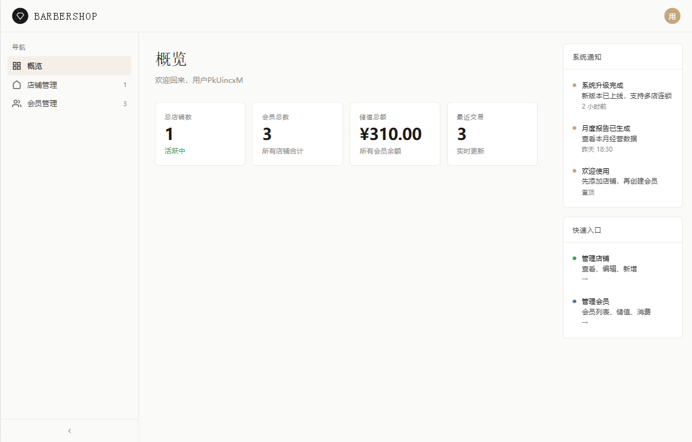

# Barbershop Service

理发店业务管理系统后端服务，提供门店、会员、交易、文件等核心能力的 RESTful 接口。

## 技术栈

| 模块        | 版本 / 选型                       |
| ----------- | --------------------------------- |
| JDK         | 11                                |
| 框架        | Spring Boot 2.7.18                |
| 持久层      | MyBatis-Plus 3.5.9                |
| 数据库      | MySQL 8.0 + Flyway 版本迁移       |
| 缓存 / 锁   | Redis + Redisson 3.24.3           |
| 对象存储    | MinIO 8.5.10                      |
| 鉴权        | JWT (jjwt 0.12.5)                 |
| 接口文档    | springdoc-openapi-ui 1.7.0        |
| 对象映射    | MapStruct 1.5.5 + Lombok          |
| 邮件        | Spring Boot Mail (SMTP)           |
| 前端        | 原生单页 HTML（[frontend/index.html](frontend/index.html)） |

## 目录结构

```
barbershop/
├── src/main/java/com/slm/barbershop/
│   ├── controller/        # Auth / Shop / Member / File
│   ├── service/           # 业务实现
│   ├── mapper/            # MyBatis-Plus Mapper
│   ├── entity/            # User / Shop / Member / MemberTransaction / FileMetadata
│   ├── model/             # DTO / VO
│   ├── converter/         # MapStruct 转换器
│   ├── config/            # Web / MyBatis-Plus / Redisson / MinIO 等配置
│   ├── lock/              # 分布式锁抽象（多模式）
│   ├── exception/         # 全局异常处理
│   ├── enums/             # 枚举
│   └── utils/             # 工具类
├── src/main/resources/
│   ├── application.yaml   # 主配置
│   ├── db/migration/      # Flyway SQL 迁移脚本
│   └── mapper/            # 自定义 XML
├── src/test/              # 单元测试
├── frontend/index.html    # 控制台单页应用
├── docker/                # Docker 构建配置
├── docker-compose.yml     # MySQL / MinIO / Redis 一键启动
├── Dockerfile
└── pom.xml
```

## 快速开始

### 环境依赖

- JDK 11+
- Maven 3.8+
- Docker（可选，用于一键拉起 MySQL / MinIO / Redis）

### 启动基础服务

```bash
docker-compose up -d mysql minio redis
```

### 本地运行

```bash
# 默认配置：服务监听 8080，context-path = /barbershop
mvn spring-boot:run
```

### 打包部署

```bash
mvn clean package -DskipTests
java -jar target/barbershop.jar
```

### 接口文档

启动后访问：

```
http://localhost:8080/barbershop/swagger-ui.html
```

## 接口约定

统一响应结构：

```json
{ "code": 0, "message": "ok", "data": { /* 业务数据 */ } }
```

主要端点（context-path: `/barbershop`）：

| 模块     | 路径前缀        | 说明             |
| -------- | --------------- | ---------------- |
| 认证     | `/auth`         | 登录、刷新令牌等 |
| 门店     | `/shop`         | 门店信息维护     |
| 会员     | `/member`       | 会员与交易流水   |
| 文件     | `/file`         | MinIO 上传/下载  |

## 配置项（环境变量）

| 变量名                       | 默认值                                | 说明                       |
| ---------------------------- | ------------------------------------- | -------------------------- |
| `SERVER_PORT`                | `8080`                                | 监听端口                   |
| `SERVER_SERVLET_CONTEXT_PATH` | `/barbershop`                         | 服务前缀                   |
| `SPRING_DATASOURCE_URL`      | `jdbc:mysql://localhost:3306/barbershop` | 数据库连接                 |
| `SPRING_DATASOURCE_USERNAME` | `root`                                | 数据库用户                 |
| `SPRING_DATASOURCE_PASSWORD` | `123456`                              | 数据库密码                 |
| `REDIS_HOST` / `REDIS_PORT`  | `localhost` / `6379`                  | Redis 连接                 |
| `REDIS_PASSWORD`             | `redis123456`                         | Redis 密码                 |
| `MINIO_ENDPOINT`             | `http://localhost:9000`               | MinIO 服务地址             |
| `MINIO_ACCESS_KEY`           | `minioadmin`                          | MinIO 账号                 |
| `MINIO_SECRET_KEY`           | `minioadmin`                          | MinIO 密码                 |
| `MINIO_BUCKET`               | `barbershop`                          | 存储桶                     |
| `JWT_SECRET`                 | （32 字节 base64）                    | JWT 签名密钥               |
| `JWT_ACCESS_TOKEN_EXPIRATION` | `86400`                              | Access Token 过期（秒）    |
| `MAIL_HOST` / `MAIL_USERNAME` / `MAIL_PASSWORD` | 163 SMTP 默认值           | 邮件通知                   |

## 开发说明

- 数据库变更一律通过 [src/main/resources/db/migration/](src/main/resources/db/migration) 中的 Flyway 脚本管理，禁止直接改库
- 会员交易等高并发写操作使用 [src/main/java/com/slm/barbershop/lock/](src/main/java/com/slm/barbershop/lock) 中的分布式锁抽象（支持 Redisson 多模式）
- 全局异常统一在 `exception/` 处理，Controller 不应捕获业务异常
- DTO / VO 与 Entity 互转统一使用 `converter/` 下的 MapStruct

## 控制台预览

控制台前端位于 [frontend/index.html](frontend/index.html)，为单文件 SPA，无构建步骤，浏览器直接打开即可。

### 控制台首页（概览）



> 截图来自 `frontend/index.html` 初始视图，左侧为导航栏（概览 / 店铺管理 / 会员管理），右侧为系统通知与快速入口。
